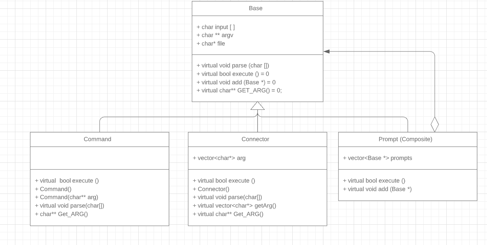
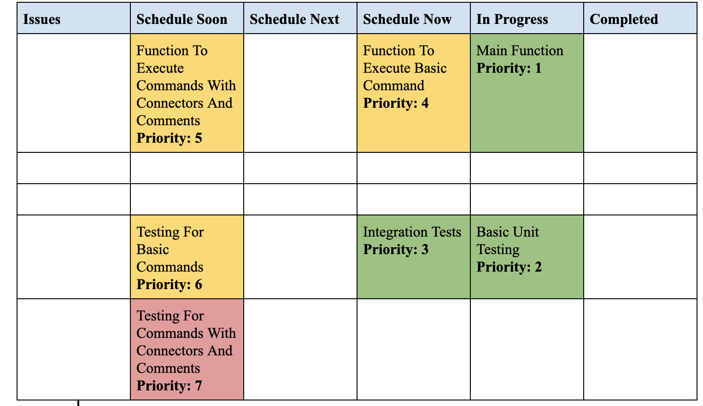

# CS 100 Programming Project

FALL 2019
Adhikar Chhibber. 862091337
Swastyak Gaur. 862063974

# Introduction

Our program in essence is a shell program which will allow the user to run basic terminal commands with the option of using connectors to execute commands. The main design pattern we used would be the composite pattern so we can process both simple and complex inputs. With any input we first take the input from the user in the command line. Then we make a varible for the connector class. Then we parse the input in the class in order to get an input that can execute. Then we go through all the connectors and special conditions to see if the input meets any of those conditions at the time. When it does, then we create a command varible to then take the parsed input that meets those demands, and executes the input. This execution will return a status which is then used to for other special cases/connectors. We also check to see if the execution needs to be tracked for complemetion. If so, then we increment our tracker then go along the rest of input until we end at the end or the input contains an exit command.

# OMT Diagram

# Classes

For our program, we will be implementing 4 classes: Base, Command, Connector, and Prompt. Our Base class in this program is the base superclass in which every other subclass will inherit from. This class has protected variables: an array of charcters for the input, and an array of character pointers for the parsed input. The class will also provide 4 functions (not including constructors or other class-unique functions): parse, execute, and add. The main objective of this class is to provide the basic template and variables to its subclasses. This class provides the method to get input and transform the input through the parsing function. The parsing function is also responsible for determining which subclass to assign the input to. Since this will be the same method no matter the input, this function will be definded and implemented in the Base class. The second function describes the execution of the input. In the base class, this will be left pure virtual since the base class does not distinguish between a normal command and a connector. The third function, add, is left pure virtual as well since it is made for the composite class prompt which will implement the function to add elements to a vector to execute the inputs.

Our subclasses are Command, Connector, and Prompt. All of these subclasses inherit from the base class (which acts as our superclass). The only difference betweent the command and connector subclasses is that both have a different method for the execute function. The Connector class takes in the input and makes calls to the Command class for the basic execution. Since each part is a command, the main function of the connector class's execution would be to track in the commands and take care of any special cases/connectors in which a basic execution would not suffice and lead to an inproper output. 

Then the final subclass is the prompt class which is a composite class unlike the command class. This subclass's implementation is to create a hierarchy of objects recursively. In this class we have a vector of Base pointers. This not only to carry both Command and Connector objects, but also to carry other Prompt objects to create a hierarchy. This is then followed by the execute function which executes all objects stored in the vector. This function mainly to represent a composite pattern where each object execute is called rather than having one complicated execute function for all types. Also when all inputs have been executed, then the vector is cleared and awaits new inputs. Then the final function is the add function which simply adds an object to the vector. 

# Prototypes/Research
For the research, we experimented with all of the fork(), waitpid() and execvp() commands in a main.cpp file, as well as creating a prototype parse function in a separate header file. What we discovered is that fork() creates a new process in the background, but does not automatically start the child process first. For the purpose of this project, we will use fork() to create new processes which will allow us to run a command. Waitpid() will ensure that the proper leaf (children) nodes are executed first, and within each of the processes execvp() will be the command that runs the user input in each process. In our main.cpp, we used these commands to get the terminal to echo "hello world!" as our demonstration of the use of all necessary commands.

For the parser, it was built using many nested for and while loops, with counters counting how many commands, connectors and arguments the user passes in. We tried to make it as bug free as possible by accounting for the fact that the user could choose to input the commands with or without spaces anywhere in the code, but there are still niche edge cases that also need to be accounted for. Additionally, the code does not have a proper way of exiting gracefully if the user inputs a terminal command that is not a valid command. 

During the prototype research, we looked into how the three main connectors: ||, ;, &&, and how they function. Tests with the semicolon connector showed that using the semicolon does not result in any difference in the commands execution and is exactly the same as executing one command at a time instead of inputting it all at one. 

The double line connector, also known as ||, was different from the rest in the fact that it relied on the last command failing in order for the next one to be run. We tested this by running this into our terminal: false || ls. We then run this command to compare the results: true || ls. From this test, we saw that the command's main rule was that if the last process did not fail, then the next one would. However if the last process did fail, the next one would be executed.

Contary to the last connector, the && conector is the exact opposite from the || connector in that the last process must have been successful in order for the next command to run. We tested this is a similar fashion by using the two inputs, false && ls, and true && ls. With only the input that had the first process being successful actually producing a result. Which told us that the && connector relied on the last process being successful to run the next one.

From all this testing, we gain an understand of the connectors and their interaction with the commands.

From coding the program we learned how certain commands function and the use of comments. Comments are a special character which typically end the input the user is on but is not actually to be inputted into the execution. This was a special case in which actively searching for the character must be a priority since no input exsists after the comment.
The echo command also taught us how the command treats its parameters. The main lession can be explained in an example. In this example we run the command: echo hello world. This command would return "hello world" (not including quotation marks). This command is exactly the same as: echo "hello world". However the main difference is when we add special character in the mix. Since special characters are constantly being searched, if the input did not have quotation marks with the parameters, then it would make an executable based on those parameters (and fail since most likely, the parameters were not commands".

# Development and Testing Roadmap

